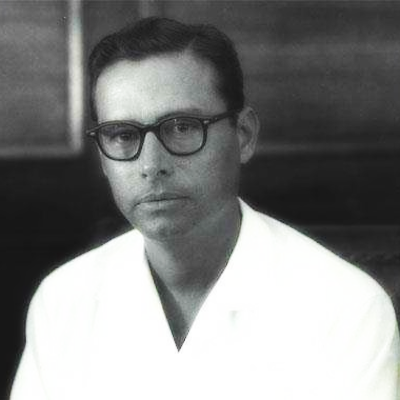

**schema-version:** 1.0
# George Cadle Price

## Info
- **Full Name:** George Cadle Price
- **Born Location:** Belize City, British Honduras
- **Birth Date:** 1919-01-15
- **Death Date:** 2011-09-19
- **Origin:** Belizean  
- **Tags:** [politician, independence leader, prime minister, statesman]

## Known For
- One of the principal architects of Belizean independence. Today he is referred to by many as the "Father of the Nation".

## Impact (to society, latino community)
- Demonstrated that peaceful, constitutional decolonization was possible in Central America and the Caribbean, providing a model for other independence movements in the region
- Helped establish Belize as a stable democratic nation in Central America, contributing to regional political development and showing that small nations could maintain sovereignty
- Promoted national unity in Belize's ethnically diverse society (Maya, Creole, Garifuna, Mestizo, and other communities), fostering inclusive national identity

## Sources
- [Wikipedia: George Cadle Price](https://en.wikipedia.org/wiki/George_Cadle_Price)